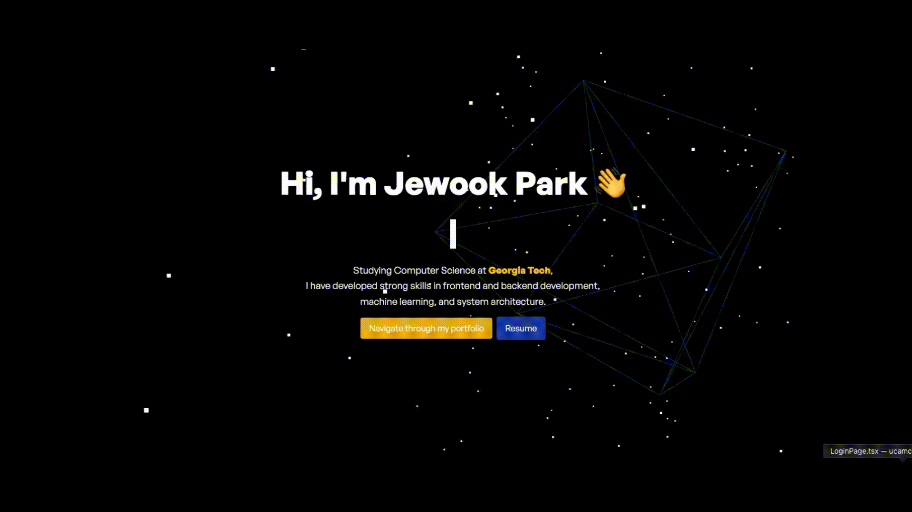

<!-- Header -->

  <!-- Social Icons -->
  

    
    
    
    
  

<!-- Technical Skills Section -->
## 🛠️ Technical Skills

### Languages

### Frameworks & Technologies

### Databases

<!-- Resume Section -->
## 📄 Resume

<!-- Footer -->
## 📫 Let's Connect

  
  
  
  

<!-- Profile Views -->

  

